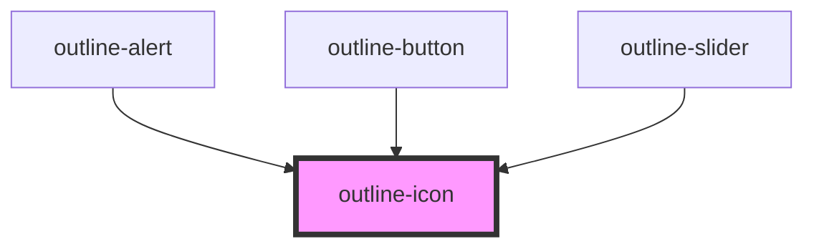

# outline-icon

<!-- Auto Generated Below -->

## Properties

| Property | Attribute | Description                                                        | Type                                                 | Default     |
| -------- | --------- | ------------------------------------------------------------------ | ---------------------------------------------------- | ----------- |
| `color`  | `color`   | The color class to apply to the icon                               | `string`                                             | `undefined` |
| `icon`   | `icon`    | The icon type to display from ./assets. Takes precedence over url. | `IconTypeCustom \| IconTypeSolid \| IconTypeOutline` | `undefined` |
| `url`    | `url`     | The url to display a remote icon                                   | `string`                                             | `''`        |

## Dependencies

### Used by

 - [outline-alert](../outline-alert)
 - [outline-button](../outline-button)
 - [outline-slider](../outline-slider)

### Graph

----------------------------------------------

*Built with [StencilJS](https://stenciljs.com/)*
